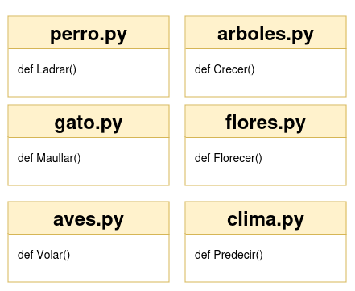

# Nuestro primer paquete

## Paso 1

Imagina que tu equipo ha escrito una gran cantidad de funciones en Python y decide agruparlas en módulos separados. Cada módulo contiene una función específica. Un ejemplo de uno de esos módulos es el siguiente:

```python
#! /usr/bin/env python3

""" module: alpha """

def funA():
    return "Alpha"

if __name__ == "__main__":
    print("Yo prefiero ser un módulo")
```

Este es el contenido del archivo `alpha.py`, y se asume que el resto de los módulos tienen una estructura similar, donde la función principal del módulo lleva el nombre de la primera letra del módulo.



## Paso 2

El equipo se da cuenta de que estos módulos forman una jerarquía natural, por lo que colocarlos en una estructura plana no es ideal. Después de discutir, se acuerda una estructura en forma de árbol, donde los módulos se agrupan de acuerdo con sus relaciones mutuas.

La estructura jerárquica propuesta es:

* **Grupo `ugly`**: contiene los módulos `psi` y `omega`.
* **Grupo `best`**: contiene los módulos `sigma` y `tau`.
* **Grupo `good`**: contiene los módulos `alpha`, `beta` y el subgrupo `best`.
* **Grupo `extra`**: contiene los subgrupos `good`, `bad` y el módulo `iota`.


Este esquema refleja la relación entre los módulos y su agrupación, similar a una estructura de directorios. El siguiente paso será construir un árbol que siga esta jerarquía.