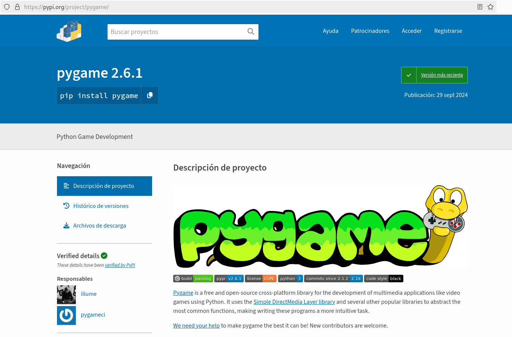

# Ejemplo de uso de pip

En este ejemplo vamos a trabajar con el paquete `pygame`, que es una biblioteca extendida y compleja que permite a los programadores desarrollar juegos de ordenador usando Python.

## Buscar información sobre pygame

Para ello accedemos a la página web de PyPi y realizamos una búsqueda del paquete:



## Instalación de pygame

Como hemos visto, la versión actual del paquete es la 2.6.1, sin embargo vamos a instalar una versión anterior. Vamos a realizar la instalación para el usuario con el que estamos trabajando (opción `--user`) y vamos a indicar que permitimos la instalación de paquetes con pip (opción `--break-system-packages`):

```
pip install --user --break-system-packages pygame==2.5.2
```

Ahora podemos ver los paquetes que tenemos instalados a nivel de usuario:

```
pip list --user
Package Version
------- -------
pygame  2.5.2
```

Y podemos obtener información del paquete:
```
pip show pygame
Name: pygame
Version: 2.5.2
Summary: Python Game Development
Home-page: https://www.pygame.org
Author: A community project.
Author-email: pygame@pygame.org
License: LGPL
Location: /home/jose/.local/lib/python3.11/site-packages
Requires: 
Required-by: 
```

* En el apartado `Location` obtenemos el directorio donde se ha instalado, como hemos usado la opción `--user` comprobamos que es el directorio de un usuario sin privilegios.
* En el apartado `Requires` obtenemos la lista de las dependencias, los paquetes que son necesarios para que este funcione.
* En el apartado `Requires-by` obtenemos la lista de paquetes que tienen como dependencia este paquete.

## Uso del paquete pygame

Una vez que tenemos instalado el paquete `pygame`, podemos hacer uso del el, y por ejemplo, podemos escribir el siguiente programa:

```
import pygame

run = True
width = 400
height = 100
pygame.init()
screen = pygame.display.set_mode((width, height))
font = pygame.font.SysFont(None, 48)
text = font.render("Bienvenido a pygame", True, (255, 255, 255))
screen.blit(text, ((width - text.get_width()) // 2, (height - text.get_height()) // 2))
pygame.display.flip()
while run:
    for event in pygame.event.get():
        if event.type == pygame.QUIT\
        or event.type == pygame.MOUSEBUTTONUP\
        or event.type == pygame.KEYUP:
            run = False
```

Podemos probar el programa, y veremos cómo se ha creado una ventana en nuestro sistema operativo.

## Actualización del paquete pygame

Actualmente estamos trabajando con una versión antigua de `pygame`, podemos actualizar a la última versión, ejecutando:

```
pip install -U --user --break-system-packages pygame
```

Y comprobamos que efectivamente hemos actualizado el paquete:

```
pip list --user
Package Version
------- -------
pygame  2.6.1
```

## Desinstalar el paquete pygame

Por último desinstalamos el paquete `pygame`, para ello ejecutamos la siguiente instrucción:

```
pip uninstall --break-system-packages pygame 
```

No es necesario indicar la opción `--user` ya que el sistema intentará desinstalar el paquete en cualquiera de los modos que se ha instalado.

