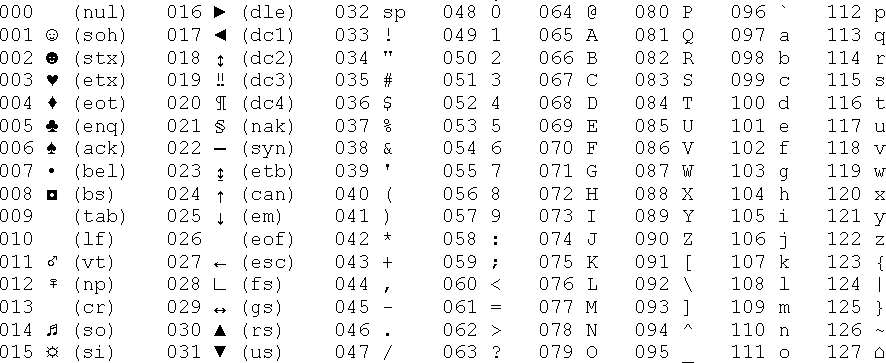

# Codificación de caracteres en Python

Cuando estamos aprendiendo Python, desarrollamos muchos programas que procesan datos numéricos. Sin embargo, muchos de los datos que los ordenadores gestionan diariamente no son números, sino texto: nombres, apellidos, direcciones, ... Estos datos también necesitan ser almacenados, procesados y transformados por los ordenadores. Pero ¿cómo lo hacen?

los ordenadores no entienden directamente los caracteres como los humanos. En su lugar, **cada carácter que vemos en una pantalla es almacenado como un número**. Esta conversión es esencial, ya que **los números son lo único que los ordenadores pueden procesar eficientemente**. De esta forma, **cada carácter tiene un valor numérico único**, y algunos de estos valores representan caracteres invisibles para los humanos pero fundamentales para el sistema, como los espacios en blanco o los saltos de línea, que ayudan a controlar dispositivos de entrada y salida.

## El estándar universal: ASCII

Dado que cada ordenador podría usar diferentes códigos para los caracteres, se necesitó un estándar universal que permitiera la interoperabilidad entre dispositivos. Así nació el código **ASCII** (American Standard Code for Information Interchange), un sistema de codificación que asigna números a caracteres específicos. Casi todos los dispositivos modernos, como ordenadores, teléfonos móviles y tabletas, utilizan ASCII para gestionar caracteres.

**Este estándar permite representar hasta 256 caracteres, aunque los primeros 128 son los más utilizados**. Por ejemplo, el espacio tiene el código 32, la letra "a" minúscula tiene el código 97, y la letra "A" mayúscula tiene el código 65. 

Uno de los aspectos más interesantes de la tabla ASCII es que **las letras están organizadas en el mismo orden que el alfabeto latino**.

