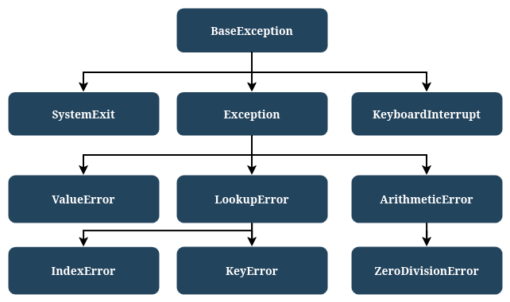

# Jerarquía de excepciones

### La jerarquía de excepciones en Python

Python 3 define 63 excepciones integradas que están organizadas en una jerarquía con forma de árbol, cuya raíz es la excepción más general. Algunas excepciones son más generales e incluyen otras excepciones, mientras que otras son más específicas.

Cuanto más cerca de la raíz esté una excepción, más **general** será. Las excepciones en las hojas del árbol son **concretas** y representan casos específicos.



## Ejemplo de jerarquía:

* **ZeroDivisionError**: una excepción específica que ocurre al intentar dividir entre cero.
* **ArithmeticError**: una clase más general que incluye a `ZeroDivisionError` y otras excepciones relacionadas con operaciones aritméticas.
* **Exception**: una excepción aún más general que incluye a `ArithmeticError` y otras muchas excepciones.
* **BaseException**: la excepción más general de todas.

Podemos representar esta jerarquía así:

```
BaseException
    ↑
Exception
    ↑
ArithmeticError
    ↑
ZeroDivisionError
```

Este orden jerárquico permite manejar excepciones de forma flexible: podemos capturar excepciones específicas o más generales dependiendo de lo que necesitemos.

## Ejemplo 

Veamos cómo funciona la jerarquía de excepciones en Python con un ejemplo simple.

```
try:
    y = 1 / 0
except ZeroDivisionError:
    print("Uuuppsss...")

print("FIN.")
```

La salida esperada sería:

```
Uuuppsss...
FIN.
```

Este código captura específicamente la excepción `ZeroDivisionError`, que ocurre cuando se intenta dividir entre cero.

Si cambiamos `ZeroDivisionError` por una excepción más general, como `ArithmeticError`, el comportamiento sigue siendo el mismo:

```
try:
    y = 1 / 0
except ArithmeticError:
    print("Uuuppsss...")

print("FIN.")
```

* **`ArithmeticError`** es una clase general que incluye la excepción específica `ZeroDivisionError`. Por lo tanto, capturar `ArithmeticError` también captura `ZeroDivisionError`.
* Reemplazar el nombre de la excepción con **`Exception`** o incluso **`BaseException`** también capturaría el error, ya que son clases más generales en la jerarquía de excepciones.
* **Cada excepción generada cae en la primera coincidencia que encuentre** en el código.
* **No es necesario especificar exactamente la excepción**, es suficiente que la excepción manejada sea más general (abstracta) que la generada.

Esto demuestra la flexibilidad del manejo de excepciones en Python, permitiendo capturar errores específicos o más amplios según las necesidades del programa.

Hagamos una modificación al código:
```
try:
    y = 1 / 0
except ZeroDivisionError:
    print("¡División entre Cero!")
except ArithmeticError:
    print("¡Problema Aritmético!")

print("FIN.")
```

Aquí, la excepción **`ZeroDivisionError`** es capturada primero, ya que es más específica. Python encuentra la coincidencia exacta y la maneja correctamente.

Si cambiamos el orden:

```
try:
    y = 1 / 0
except ArithmeticError:
    print("¡Problema Aritmético!")
except ZeroDivisionError:
    print("¡División entre Cero!")

print("FIN.")
```

* **`ArithmeticError`** es más general e incluye a **`ZeroDivisionError`**. Como está primero, captura la excepción antes de que el programa llegue al bloque específico de `ZeroDivisionError`.
* **Resultado**: El bloque de `ZeroDivisionError` se vuelve **inaccesible** porque la excepción ya fue capturada por el bloque general.

Por lo tanto hay que tener en cuenta que:

1. **El orden de los bloques `except` es crucial**: Siempre coloca las excepciones más específicas antes que las más generales.
2. **Excepciones más generales** como `ArithmeticError` pueden capturar un rango más amplio de errores, lo que puede hacer que las excepciones específicas sean inalcanzables.
3. Aunque Python no genera errores al respecto, este mal uso puede hacer que el código sea desordenado e inconsistente.

## Manejo de múltiples excepciones 

Cuando deseas manejar más de una excepción de la misma manera, puedes usar la siguiente sintaxis:

```
try:
    # Código que puede fallar
except (exc1, exc2):
    # Código que maneja ambas excepciones
```

Solo necesitas poner las excepciones separadas por comas dentro de un conjunto de paréntesis. Esto permite agrupar excepciones similares y manejar su tratamiento de manera conjunta.

