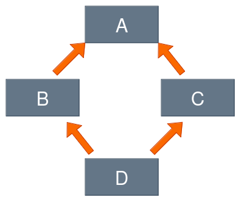

# Herencia simple frente a herencia múltiple

La herencia múltiple en Python permite derivar una clase nueva de más de una clase existente. Sin embargo, aunque esta característica está disponible, su uso debe considerarse con precaución. Tienes que tener en cuanta algunos aspectos:

* Una clase construida con herencia simple siempre es más simple, segura y fácil de entender y mantener.
* La herencia múltiple siempre es arriesgada, ya que tienes muchas más oportunidades de cometer un error al identificar estas partes de las superclases que influirán efectivamente en la nueva clase.
* La herencia múltiple puede hacer que la anulación sea extremadamente difícil; además, el emplear la función `super()` se vuelve ambiguo.
* La herencia múltiple viola el **principio de responsabilidad única** (mas detalles aquí: https://en.wikipedia.org/wiki/Single_responsibility_principle), que dice: **"Una clase debe tener una única razón para cambiar, es decir, sólo debe tener una responsabilidad o propósito"**. La herencia múltiple puede causar problemas de ambigüedad y romper el principio de responsabilidad única ya que puede recibir el propósito o responsabilidad de cada una de las superclases.
* Utiliza la herencia múltiple como la última de todas las posibles soluciones: si realmente necesitas las diferentes funcionalidades que ofrecen las diferentes clases, la composición puede ser una mejor alternativa.

## Orden de Resolución de Métodos (MRO) en Python

El **Orden de Resolución de Métodos (MRO)** es la estrategia que utiliza Python para determinar el método que debe ejecutarse o el atributo que debe usarse cuando hay múltiples opciones disponibles debido a la herencia. Dado que diferentes lenguajes de programación pueden implementar MRO de diversas maneras, Python tiene su propia forma única de manejarlo, lo cual es crucial para evitar ambigüedades en las jerarquías de clases.

A continuación, se presentan dos ejemplos que ilustran cómo funciona el MRO y los problemas que pueden surgir al usar herencia múltiple de forma imprudente.

```
class Top:
    def m_top(self):
        print("top")

class Middle(Top):
    def m_middle(self):
        print("middle")

class Bottom(Middle, Top):
    def m_bottom(self):
        print("bottom")

object = Bottom()
object.m_bottom()  # Salida: bottom
object.m_middle()  # Salida: middle
object.m_top()     # Salida: top
```
   
Este ejemplo no tiene problemas: el MRO sigue el orden de las clases, y todo funciona como se espera, produciendo la salida predecible: 
   
Sin embargo el siguiente ejemplo nos va a provocar algún problema al modificar la definición de la clase `Bottom`:

```
class Top:
    def m_top(self):
        print("top")

class Middle(Top):
    def m_middle(self):
        print("middle")

class Bottom(Top, Middle):
    def m_bottom(self):
        print("bottom")

object = Bottom()
object.m_bottom()  # Salida esperada: bottom
object.m_middle()  # Salida esperada: middle
object.m_top()     # Salida esperada: top
```

Al ejecutar este código, se genera un error:

```
TypeError: Cannot create a consistent method resolution order (MRO) for bases Top, Middle
```

## El Problema del Diamante en herencia múltiple

El **Problema del Diamante** es un concepto clásico que ilustra una complicación en la herencia múltiple. Este problema surge en una jerarquía de clases donde una superclase se divide en dos subclases, las cuales a su vez se combinan en una subclase más específica. Visualmente, esta estructura toma la forma de un diamante. Aquí está el esquema:



Algunos lenguajes de programación, como Java y C#, no permiten la herencia múltiple para evitar este tipo de problemas. Sin embargo, Python permite la herencia múltiple, lo que puede llevar a confusiones si no se tiene en cuenta el **Orden de Resolución de Métodos (MRO)**.

Veamos un ejemplo:

```
class Top:
    def m_top(self):
        print("top")

class Middle_Left(Top):
    def m_middle(self):
        print("middle_left")

class Middle_Right(Top):
    def m_middle(self):
        print("middle_right")

class Bottom(Middle_Left, Middle_Right):
    def m_bottom(self):
        print("bottom")

object = Bottom()
object.m_bottom()  # Salida: bottom
object.m_middle()  # ¿Qué se verá aquí?
object.m_top()     # Salida: top
```

La clave del Problema del Diamante es determinar cuál método se invocará cuando llames a `object.m_middle()`. En este caso, se ejecutará el método `m_middle()` de la clase **Middle_Left**, ya que aparece primero en la lista de herencia de la clase **Bottom**. 

Si intercambias las clases en la lista de herencia, el resultado cambiará. Esta es una demostración clara de cómo el MRO afecta la resolución de métodos en estructuras de herencia múltiple.

## Cuestionario

El siguiente fragmento de código se ha ejecutado con éxito:

```
class Dog:
    kennel = 0
    def __init__(self, breed):
        self.breed = breed
        Dog.kennel += 1
    def __str__(self):
        return self.breed + " dice: ¡Guau!"


class SheepDog(Dog):
    def __str__(self):
        return super().__str__() + " ¡No huyas, corderito!"


class GuardDog(Dog):
    def __str__(self):
        return super().__str__() + " ¡Quédese donde está, intruso!"


rocky = SheepDog("Collie")
luna = GuardDog("Dobermann")
```

1. ¿Cuál es el resultado esperado del siguiente código?

    ```
    print(rocky)
    print(luna)
    ```

2. ¿Cuál es el resultado esperado del siguiente código?

    ```
    print(issubclass(SheepDog, Dog), issubclass(SheepDog, GuardDog))
    print(isinstance(rocky, GuardDog), isinstance(luna, GuardDog))
    ```

3. ¿Cuál es el resultado esperado del siguiente código?
    
    ```
    print(luna is luna, rocky is luna)
    print(rocky.kennel)
    ```

4. Define una subclase de `SheepDog` llamada `LowlandDog`, y equipala con un método `__str__()` que anule un método heredado del mismo nombre. El nuevo método `__str__()` debe retornar la cadena `"¡Guau! ¡No me gustan las montañas!"`. 

## Solución cuestionario

1. Ejercicio 1

    ```
    Collie dice: ¡Guau! ¡No huyas, corderito!
    Dobermann dice: ¡Guau! ¡Quédese donde está, intruso!
    ```

2. Ejercicio 2

    ```
    True False
    False True
    ```

3. Ejercicio 3

    ```
    True False
    2
    ```

4. Ejercicio 4

    ```
    class LowlandDog(SheepDog):
	def __str__(self):
		return Dog.__str__(self) + " ¡No me gustan las montañas"
    ```

