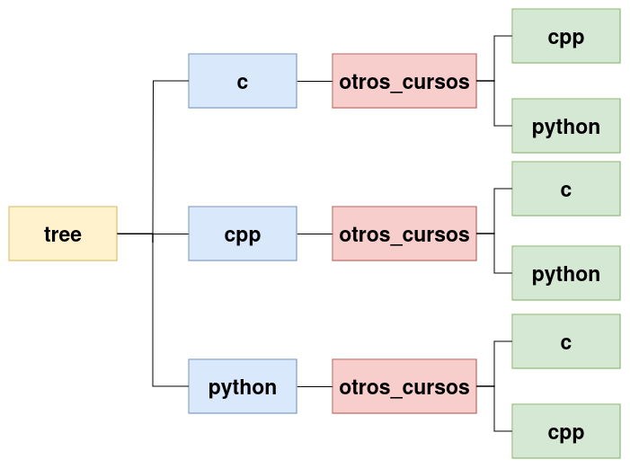

# LABORATORIO: El módulo os

## Tiempo Estimado

15 - 30 minutos

## Nivel de Dificultad

Fácil

## Objetivos

* Mejorar las habilidades del estudiante para interactuar con el sistema operativo.
* Uso práctico de funciones conocidas proporcionadas por el módulo os.

## Escenario

Queremos escribir un programa que permita buscar archivos y directorios. Como hemos aprendido el módulo `os` tiene todas las funciones necesarias para realizar dicho programa.
Para facilitar tu tarea, hemos preparado una estructura de directorio de prueba para ti:



Tu programa debe cumplir con los siguientes requisitos:

* Escribe una función o método llamado `find` que tome dos argumentos llamados `path` y `dir`. El argumento `path` debe aceptar una ruta relativa o absoluta a un directorio donde debe comenzar la búsqueda, mientras que el argumento `dir` debe ser el nombre de un directorio en el que deseas encontrar la ruta dada. Tu programa debería mostrar las rutas absolutas si encuentra un directorio con el nombre dado.
* La búsqueda en el directorio debe realizarse de forma recursiva. Esto significa que la búsqueda también debe incluir todos los subdirectorios en la ruta dada.

## Salida esperada

Si la entrada es:

`path="./tree", dir="python"`

Salida de ejemplo:

```
.../tree/python
.../tree/cpp/other_courses/python
.../tree/c/other_courses/python
```
