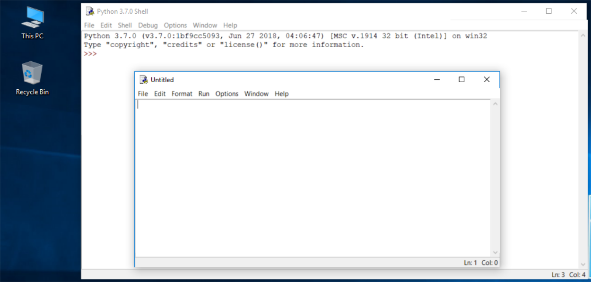

# Nuestro primer programa en Python

## Cómo escribir y ejecutar tu primer programa

Ahora es el momento de escribir y ejecutar tu primer programa en Python3. Por ahora, será muy simple.

1. El primer paso es crear un nuevo archivo fuente para escribir el código fuente. Haz clic en *File* en el menú del IDLE y selecciona *New File*.

    

    Como puedes ver, IDLE abre una nueva ventana para ti. Puedes usarla para escribir y modificar tu código.

    Esta es la **ventana del editor**, donde vamos a escribir nuestro programa.

2. La ventana del editor actualmente no tiene título, pero es una buena práctica comenzar a trabajar nombrando el archivo fuente.

    Haz clic en *File* (en la nueva ventana), luego haz clic sobre *Save as ...* , selecciona una carpeta para el nuevo archivo  y elige un nombre para el nuevo archivo. Los archivos con programas Python tienen como **extensión .py**.

    

3. Ahora vamos a escribir nuestro primer programa, que sólo va a tener una línea.

    Ahora solo coloca una línea en tu ventana de editor recién abierta y con nombre.

    ```
    print("Hisssssss...")
    ```
    

    Guarda el archivo (*File -> Save*) y ejecuta el programa (*Run -> Run Module*).

4. Si todo sale bien y no hay errores en el código, la **ventana de la consola** mostrará los efectos causados por la ejecución del programa.

    En este caso, el programa se ejecutará de manera correcta y mostrará `Hisssssss...` en la consola.
    Para terminar vamos a cerrar la ventana con la que estamos trabajando.

    

## Cómo estropear y arreglar tu código

Ahora ejecuta IDLE nuevamente.

* Haz clic en *File*, *Open*, señala el archivo que guardaste anteriormente y deja que IDLE lo lea de nuevo.
* Intenta ejecutarlo de nuevo presionando *F5* cuando la ventana del editor esté activa.

Veamos alguna características del editor:

* Si quitas el último paréntesis y lo vuelves a escribir, el editor resalta el texto que hay entre paréntesis.

    

    Cada vez que coloques el paréntesis de cierre en tu programa, IDLE mostrará la parte del texto limitada con un par de paréntesis correspondientes. Esto te ayuda a recordar **colocarlos en pares**.

* Retira nuevamente el paréntesis de cierre. El código se vuelve erróneo. Ahora contiene un error de sintaxis. IDLE no debería dejar que lo ejecutes.

    Intenta ejecutar el programa de nuevo. IDLE te recordará que guardes el archivo modificado. Sigue las instrucciones.

    Al intentar ejecutar el código, el IDLE te dará un **error** porque ha detectado que el programa no se ha terminado de escribir.

    

    Arregla el código, escribiendo el paréntesis final y vuelve a ejecutar el programa.

* Ahora, vamos a provocar otro error: elimina una letra de la palabra `print`. Ejecuta el código presionando *F5*. Como puedes ver, Python no puede reconocer la instrucción (no la colorea).

    

    Hemos introducido un error sintáctico, por lo que el error que nos aparece el distinto al anterior. Esto se debe a que la naturaleza del error es diferente y el error se descubre en una etapa diferente de la interpretación.

    

    La ventana del editor no proporcionará ninguna información útil sobre el error, pero es posible que las ventanas de la consola si.
    
    El mensaje (en rojo) muestra (en las siguientes líneas):

    * El **rastreo o traceback** (que es la ruta que el código atraviesa a través de diferentes partes del programa, puedes ignorarlo por ahora, ya que está vacío en un código tan simple).
    * La **ubicación del error** (el nombre del archivo que contiene el error, el número de línea y el nombre del módulo); Hay que tener en cuenta que el número puede ser engañoso, ya que Python generalmente muestra el lugar donde se percata por primera vez de los efectos del error, no necesariamente del error en sí.
    * El **contenido de la línea errónea**. Podemos configurar la ventana del editor para que muestre el número de línea y que sea más fácil posicionarnos en el error.
    * El **nombre del error y una breve explicación**.
