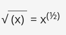
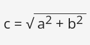

# Trabajando con variables

## Creando variables

* En Python no hace falta declarar el tipo de dato que una variable. En una variable puedo guardar el resultado de cualquier expresión (recuerda que una expresión puede ser un literal, una variable u operaciones entre literales y variables).
* El **valor de la variable** es el valor del dato que guardamos en ella. Puede variar tanto como se necesite o requiera. El valor puede ser entero, después flotante, y eventualmente ser una cadena.
* **Una variable se crea cuando se le asigna un valor**. Si se le asigna cualquier valor a una variable que no existente, la variable será automáticamente creada. No se necesita hacer algo más. A diferencia de otros lenguajes de programación, no es necesario **declararla**. Python es un lenguaje **de tipo dinámico**, lo que significa que no se necesita declarar variables en él.
* El **tipo de dato** de una variable coincidirá con el tipo del dato almacenado.
* La creación (o su sintaxis) es muy simple: **solo utiliza el nombre de la variable deseada, después el signo de igual (=) y el valor que se desea colocar dentro de la variable**. 

Veamos un ejemplo:

```
var = 1
print(var)
type(var)
```

* La primera crea una variable llamada `var`, y le **asigna** un literal con un valor entero de `1`.
* La segunda imprime el valor de la variable recientemente creada en la consola. `print()` tiene una función más: nos permite imprimir el valor de la variable.
* La tercera nos permite obtener el tipo de datos de la variable, evidentemente es de tipo `int`.

## Utilizando variables

Se tiene permitido utilizar cuantas declaraciones de variables sean necesarias para lograr el objetivo del programa, por ejemplo:

```
var = 1
account_balance = 1000.0
client_name = 'John Doe'
print(var, account_balance, client_name)
print(var)
```

Sin embargo, no se permite utilizar una variable que no exista, (en otras palabras, una variable a la cual no se le ha dado un valor).

Este ejemplo ocasionará un error:

```
var = 1
print(Var)
```

Se ha tratado de utilizar la variable llamada `Var`, la cual no tiene ningún valor (`var` y `Var` son entidades diferentes, y no tienen nada en común dentro de Python).

## Imprimiendo variables

* Podemos usar `print()` para imprimir los valores de las variables. Podemos indicar distintas variables en distintos argumentos:
    ```
    print(var, account_balance, client_name)
    ```
* Por lo tanto podemos mostrar con `print()` literales, variables, expresiones, por ejemplo:
    ```
    numero1 = 3
    numero2 = 4
    print("La suma de", numero1, "y", numero2, "es", numero1+numero2)

* Si tenemos una variable de tipo cadena de caracteres, es decir, guarda una cadena, podemos utilizar el operador `+` (concatenar o unir cadenas)  para mostrar cadenas con variables usando el `print(), por ejemplo:
    ```
    var = "3.8.5"
    print("Versión de Python: " + var)
    ```

## Asignar un valor nuevo a una variable ya existente

¿Cómo se le asigna un valor nuevo a una variable que ya ha sido creada? De la misma manera. Solo se necesita el **signo de igual**.

**El signo de igual es de hecho un operador de asignación**. Asigna el valor del argumento de la derecha al de la izquierda, aún cuando el argumento de la derecha sea una expresión arbitraria compleja que involucre literales, operadores y variables definidas anteriormente.

Observa el siguiente código:

```
var = 1
print(var)
var = var + 1
print(var)
var = 3
print(var)
var = 2 + 2 
print(var)
```

El código envía dos líneas a la consola:

```
1
2
3
```

* La primer línea del código crea una nueva variable llamada `var` y le asigna el valor de `1`. La declaración se lee de la siguiente manera: asigna el valor de `1` a una variable llamada `var`. De manera más corta: asigna `1` a `var`.
* La tercera línea le asigna a la misma variable un nuevo valor tomado de la variable misma, sumándole 1. **Python trata el signo = no como igual a, sino como asigna un valor**. El valor de la variable `var` ha sido incrementado por uno, lo cual no está relacionado con comparar la variable con otro valor.
* La tercera línea le asigna otro valor a la variable `var`.
* La quinta línea asigna un nuevo valor a `var` que es el resultado de la realización de la suma.

## Resolviendo problemas matemáticos simples

Ahora deberías de ser capaz de construir un programa el cual resuelva problemas matemáticos sencillos como el Teorema de Pitágoras: El cuadrado de la hipotenusa es igual a la suma de los cuadrados de los dos catetos.

El siguiente código calcula la longitud de la hipotenusa (es decir, el lado más largo de un triangulo rectángulo, el opuesto al ángulo recto) utilizando el Teorema de Pitágoras:

```
a = 3.0
b = 4.0
c = (a ** 2 + b ** 2) ** 0.5
print("c =", c)
```

Hay que tener en cuenta que se necesita hacer uso del operador ** para calcular la raíz cuadrada:



y



## Operadores Abreviados

Hemos estudiado que podemos hacer una asignación a una variable operando sobre la misma variable, por ejemplo:

```
x = x * 2
y = y + 1
```

Estás dos expresiones se pueden abreviar de la siguiente manera:

```
x *= 2
y += 1
```

En resumen, si `op` es un operador de dos argumentos (esta es una condición muy importante) y el operador es utilizado en el siguiente contexto:

```
variable = variable op expresión
```

Podemos simplificarlo como:

```
variable op= expresión
```

Observa los siguientes ejemplos. Asegúrate de entenderlos todos.

```
i = i + 2 * j ⇒ i += 2 * j
var = var / 2 ⇒ var /= 2
rem = rem % 10 ⇒ rem %= 10
j = j - (i + var + rem) ⇒ j -= (i + var + rem)
x = x ** 2 ⇒ x **= 2
```

## Cuestionario

1. ¿Cuál es el resultado del siguiente fragmento de código?

    ```
    var = 2
    var = 3
    print(var)
    ```

2. ¿Cuáles de los siguientes nombres de variables son ilegales en Python?

    ```
    my_var
    m
    101
    averylongvariablename
    m101
    m 101
    Del
    del
    ```

3. ¿Cuál es el resultado del siguiente fragmento de código?

    ```
    a = '1'
    b = "1"
    print(a + b)
    ```

4. ¿Cuál es el resultado del siguiente fragmento de código?

    ```
    a = 6
    b = 3
    a /= 2 * b
    print(a)
    ```

## Solución cuestionario

1. Pregunta 1:

    ```
    3
    ```

2. Pregunta 2:

    ```
    my_var
    m
    101 # incorrecto (comienza con un dígito)
    averylongvariablename
    m101
    m 101 # incorrecto (contiene un espacio)
    Del
    del # incorrecto (es una palabra clave reservada)
    ```

3. Pregunta 3:

    ```
    11
    ```

4. Pregunta 4:

    ```
    1.0
    ```

    Explicación:

    ```
    2 * b = 6   
    a = 6 → 6 / 6 = 1.0 
    ```