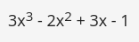

# LABORATORIO - Operadores y expresiones

## Tiempo Estimado

20 minutos

## Nivel de Dificultad

Intermedio

## Objetivos
 
* Familiarizarse con los conceptos de números, operadores y expresiones aritméticas en Python.
* Comprender la precedencia y asociatividad de los operadores de Python, así como el correcto uso de los paréntesis.

## Escenario

La tarea es completar el código para poder calcular la siguiente expresión: 



El resultado debe de ser asignado a `y`.

```
x =  # codifica aquí tus datos de prueba
# escribe tu código aquí
print("y =", y)
```

## Datos de Prueba

Entrada de muestra: `0`
Salida esperada: `y = -1`

Entrada de muestra: `1`
Salida esperada: `y = 3.0`

Entrada de muestra: `-1`
Salida esperada: `y = -9`


