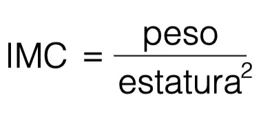

# Ejemplo 1: Cálculo del IMC

## Versión 1

Definamos una función que calcula el **Índice de Masa Corporal (IMC)**.
El IMC es igual al peso en kilogramos dividido por la altura en metros al cuadrado:



Como puedes observar, la formula necesita dos valores:

* peso (originalmente en kilogramos).
* altura (originalmente en metros).

La nueva función tendrá dos parámetros. Su nombre será `imc`:

```
def imc(weight, height):
    return weight / height ** 2


print(imc(52.5, 1.65))
```

El resultado del ejemplo anterior es el siguiente: `19.283746556473833`.

## Versión 2

La función hace lo que deseamos, pero es un poco sencilla, asume que los valores de ambos parámetros son significativos. Se debe comprobar que son confiables.

Vamos a comprobar ambos y regresar None si cualquiera de los dos es incorrecto.

```
def imc(weight, height):
    if height < 1.0 or height > 2.5 or \
    weight < 20 or weight > 200:
        return None

    return weight / height ** 2


print(imc(352.5, 1.65))
```
* Nos aseguramos que los datos que sean ingresados sean correctos, de lo contrario la salida será: `None`.
* Hemos usado el símbolo de diagonal invertida (`\`) para separar en varias líneas una instrucción. Esto puede ser útil cuando se tienen líneas largas de código y se desea que sean más legibles.

## Versión 3

Veamos otra versión del programa que permita utilizar otras unidades de medida, por ejemplo: libras, pies y pulgadas.

Para ello vamos a escribir dos funciones sencillas para convertir unidades del sistema inglés al sistema métrico. Por ejemplo sabemos que 1 libra = 0.45359237 kg. Esto lo emplearemos en nuestra nueva función:

```
def libra_a_kg(lb):
    return lb * 0.45359237
print(libra_a_kg(1))
```

El resultado de la prueba es el siguiente: `0.45359237`.

Hacemos dos nuevas funciones para convertir los pies y las pulgadas. Vemos la función que me permite convertir a metros, sabiendo que 1 pie = 0.3048 m, y 1 pulgada = 2.54 cm = 0.0254 m.

```
def pie_pulgada_a_metro(ft, inch):
    return ft * 0.3048 + inch * 0.0254


print(pie_pulgada_a_metro(1, 1))
```

El resultado de esta prueba es: `0.3302`.

En ocasiones es posible que queramos convertir sólo pies, tendríamos que llamar a la función de esta manera:
```
print(pie_pulgada_a_metro(6, 0))
```

Y la salida sería: `1.8288000000000002`.

Pero podemos modificar la función para indicar un valor predeterminado al parámetro de la función:

```
def pie_pulgada_a_metro(ft, inch = 0.0):
    return ft * 0.3048 + inch * 0.0254


print(pie_pulgada_a_metro(6))
```
Y evidentemente nos daría el mismo resultado.

Ahora podríamos calcular el IMC utilizando unidades de medida británicas, con el siguiente programa:

```
def pie_pulgada_a_metro(ft, inch = 0.0):
    return ft * 0.3048 + inch * 0.0254


def libra_a_kg(lb):
    return lb * 0.45359237


def imc(weight, height):
    if height < 1.0 or height > 2.5 or weight < 20 or weight > 200:
        return None
    
    return weight / height ** 2


print(imc(weight = libra_a_kg(176), height = pie_pulgada_a_metro(5, 7)))
```

La respuesta es: `27.565214082533313`

