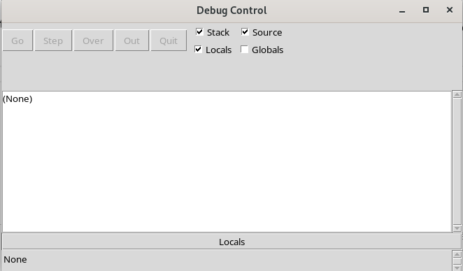
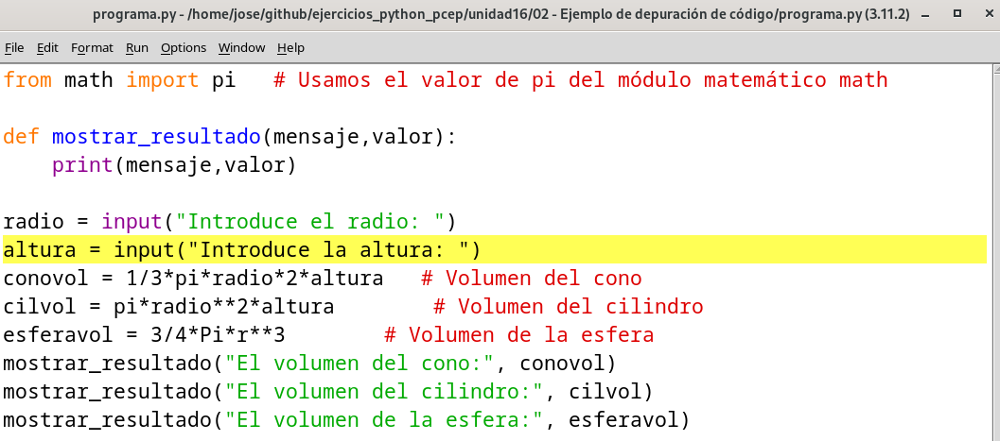
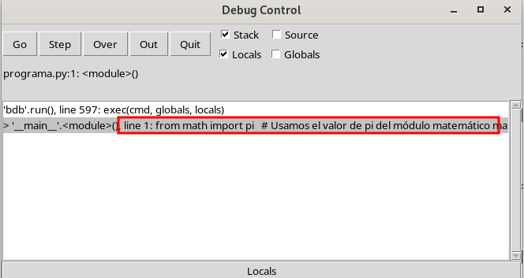
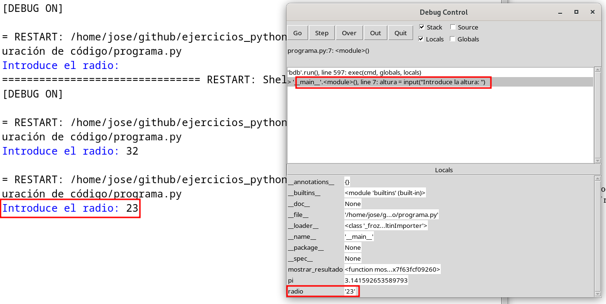
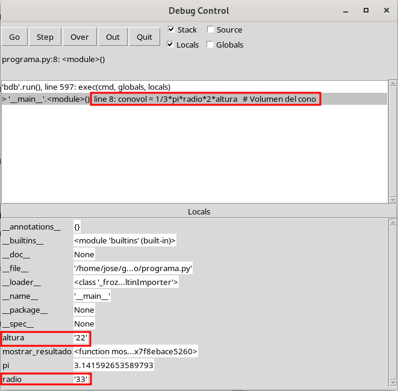
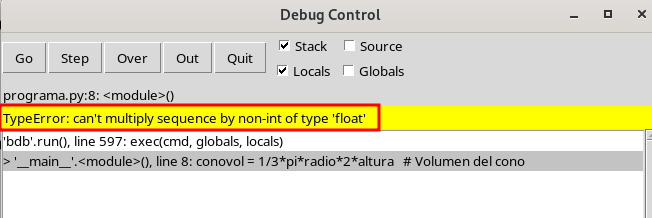
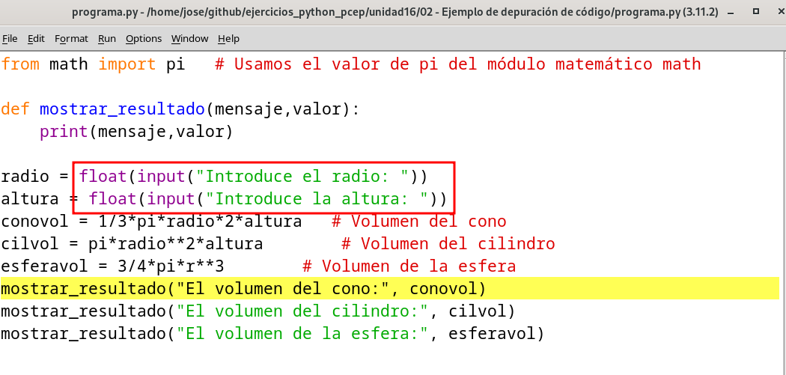
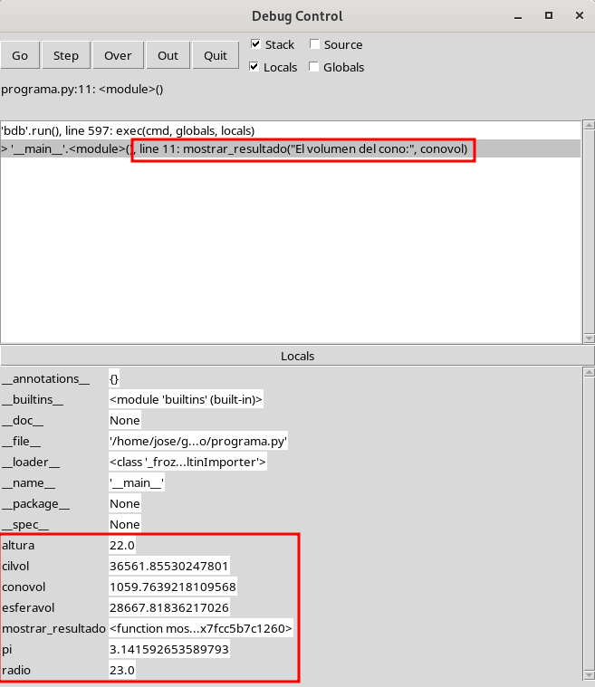

# Ejemplo de depuración de código

Vamos a depurar con IDLE el siguiente programa:

```
from math import pi   # Usamos el valor de pi del módulo matemático math

def mostrar_resultado(mensaje,valor):
    print(mensaje,valor)

radio = input("Introduce el radio: ")
altura = input("Introduce la altura: ")
conovol = 1/3*pi*radio*2*altura   # Volumen del cono
cilvol = pi*radio**2*altura        # Volumen del cilindro
esferavol = 3/4*pi*r**3        # Volumen de la esfera
mostrar_resultado("El volumen del cono:", conovol)
mostrar_resultado("El volumen del cilindro:", cilvol)
mostrar_resultado("El volumen de la esfera:", esferavol)
```

* El programa solicita el radio y calcula el volumen de distintas figuras geométricas con esos datos.
* Utilizamos la variable `pi` con el valor del número Pi del módulo matemático `math`.
* Hemos creado una función que muestra un mensaje y el valor calculado.
* El programa tiene varios errores, y vamos a depurar el código para solucionarlos.

## Activación del depurador

Para activar el modo depuración en IDLE nos vamos a la ventana del terminal y elegimos la opción *Debug* -> *Debugger* y aparecerá dicha ventana:



Si te fijas en la ventana del terminal se indica que estamos depurando con el mensaje `[DEBUG ON]`.
Ahora podemos pulsar F5 para ejecutar nuestro programa y en la ventana de depuración nos irá saliendo la instrucción que se va a ejecutar.

En este punto, si queremos podemos indicar un punto de ruptura (**breakpoint**), que nos permite señalar una línea del código. La ejecución del código se realizará de formal normal hasta que llegue a la línea indicada donde se parará la ejecución para que podamos ejecutar el programa pasa a paso.

Pongamos un punto de ruptura, para ello nos vamos a la línea que queramos, botón derecho del ratón y la opción *Set Breakpoint*. La línea se resalta de amarillo:



A continuación ejecutamos el programa con F5, y en la ventana de depuración observamos que se ha parado en la primera línea para que indiquemos cómo queremos ejecutar el programa:



Ahora podemos pulsar la opción *Go* y la ejecución seguirá de formal normal hasta que llegue al Breakpoint. Evidentemente en este programa tendremos que ir a la ventana de la consola, para introducir el valor que nos solicita: el radio y a continuación veremos de nuevo en la ventana de depuración que se ha quedado parado en la instrucción donde indicamos el punto de ruptura.



Observa que además podemos ver en todo momento el valor que van tomando las variables, en nuestro caso la variable `radio`.

Ahora que la ejecución está detenida, podemos ejecutar las instrucciones paso a paso, para ello tenemos dos opciones:

* *Step*: Me permite ejecutar paso a paso la instrucción, si la instrucción es una función ejecuta paso a paso las instrucciones internas de la función.
* *Over*: Me permite ejecutar paso a paso la instrucción sin entrar internamente en las funciones.

En este caso, como va a ejecutar la función `input()` es recomendable elegir la opción *Over*. Y en la ventana de la consola indicamos el valor que nos solicita, la altura de la figura.

A continuación vemos como la siguiente instrucción es la que permite el cálculo del volumen del cono:



Y al ejecutarla, pulsando la opción *Over*, vemos que obtenemos un error:



Estamos intentando operar con valores que son cadenas de caracteres no números reales, tenemos que corregir el programa. En la ventana de depuración pulsamos la opción *Quit* para terminal la depuración. Modificamos el programa, quitamos el Breakpoint actual (opción *Clear Breakpoint*) y ponemos un Breakpoint en una instrucción más adelantada:



Volvemos a iniciar la depuración y nos desplazamos a la instrucción con el Breakpoint. Y vemos que la próxima instrucción es la ejecución de una función definida por nosotros:



Vemos el valor de todas las variables, y ahora, como hemos indicado anteriormente, si elegimos la opción *Step* veríamos cómo se ejecuta paso a paso las instrucciones del cuerpo de la función, y si elegimos la opción *Over* se ejecutaría esta instrucción y pasaría a la siguiente.

Por último indicar que si estás ejecutando paso a paso instrucciones del cuerpo de una función, puedes elegir la opción *Out* para salir de la función y seguir ejecutando la siguiente instrucción.


