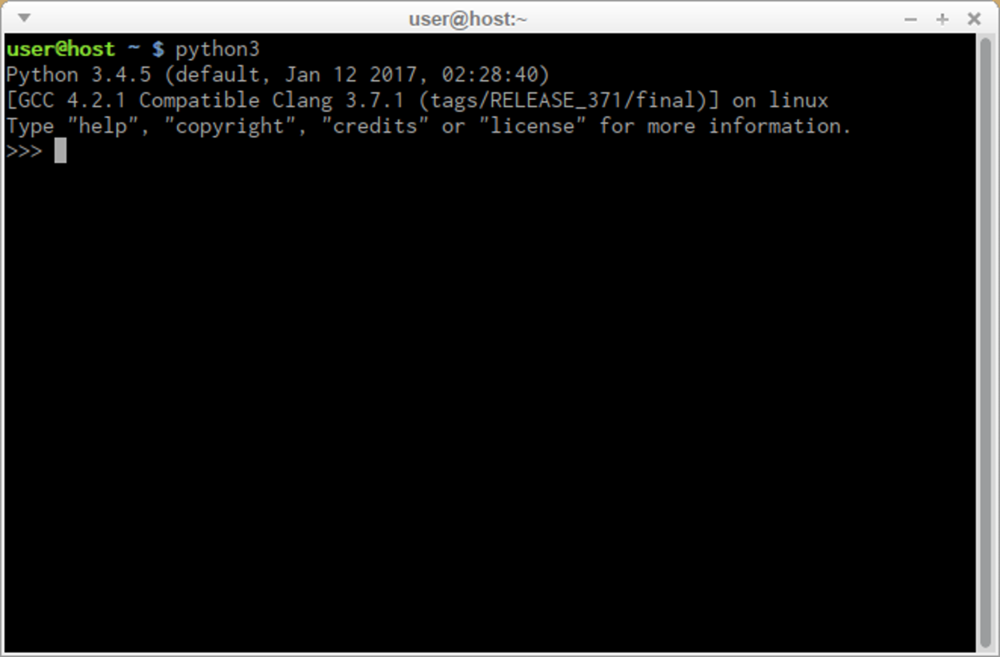
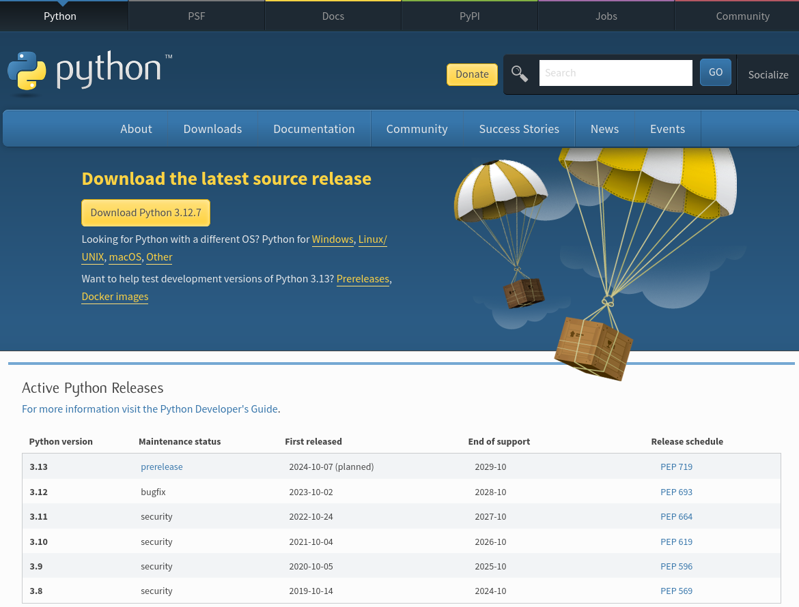

# Instalación de Python

Existen varias formas de obtener tu propia copia de Python 3, dependiendo del sistema operativo que utilices.

## Linux

Es probable que los usuarios de Linux tengan Python ya instalado. Esto es debido a que muchas de la utilidades y comandos que utilizamos en Linux están escritos con Python.

Para comprobar que tienes Python instalado, ejecuta desde la terminal el siguiente comando:

```
python3
```

Y debe aparecer algo así:



## Windows / MacOS

Todos los usuarios que no sean de Linux pueden descargar una copia en [https://www.python.org/downloads/](https://www.python.org/downloads/).

## Cómo descargar, instalar y configurar Python

* La página de descarga detecta el sistema operativo que tenemos instalado, lo único que tenemos que hacer es descargar la versión que deseamos.
* En este caso, selecciona Python 3. El sitio siempre te ofrece la última versión.
* Si eres un usuario de Windows, utiliza el archivo .exe descargado y sigue todos los pasos.
* Deja las configuraciones predeterminadas que el instalador sugiere por ahora, con una excepción: observa la casilla de verificación denominada **Agregar Python 3.x a PATH y selecciónala**.
* Si eres un usuario de macOS, es posible que ya se haya preinstalado una versión de Python 2 en tu ordenador, pero como estaremos trabajando con Python 3, aún deberás descargar e instalar el archivo .pkg correspondiente desde el sitio de Python.

