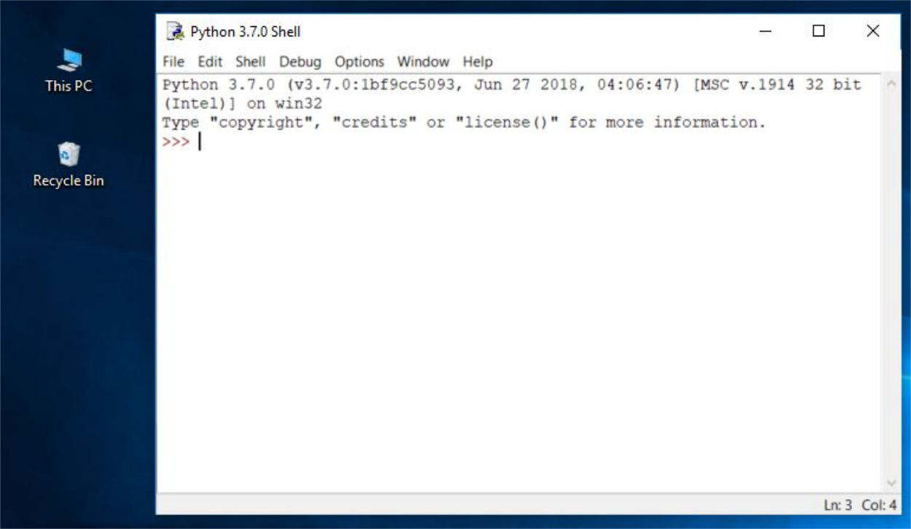

# Escribir y ejecutar programas python

Podemos ejecutar código python de varia maneras:

## Uso del interprete

Al instalar python3 el ejecutable del interprete lo podemos ejecutar `python3`:

    ```
	$ python3
    ...
    >>> 
    ```

En este interprete podemos escribir instrucciones Python y veremos el resultado de se ejecución.


## A partir de un fichero con el código fuente

Si tenemos nuestro programa en un fichero fuente (suele tener extensión `py`), por ejemplo `programa.py`,lo ejecutaríamos de la siguiente manera.
	
	$ python3 programa.py


## Usando un IDE

Para escribir un fichero con el código fuente de nuestro programa tenemos varias opciones:

* Podemos usar un IDE (entorno de desarrollo integrado), que además de la posibilidad  de editar el código, nos ofrezca otras herramientas: depuración de código, generación automático de código, ayuda integrada, manejo del proyecto, gestión de los sistemas de control de versiones,..). Existen muchos IDE a nuestra disposición: [Entornos de desarrollo para python](https://wiki.python.org/moin/IntegratedDevelopmentEnvironments).

En este curso vamos usar un IDE llamado **IDLE** que tiene las siguientes características:

* **Multiplataforma**: funciona en su mayoría igual en Windows, Unix y macOS.
* **La ventana del interprete de Python** (interprete interactivo) con coloreado de código de entrada, salida y mensajes de error
* **Editor de texto multiventana**: con identación automática, coloreado del código, ayuda, autocompletado, ...
* **Depurador** capaz de ejecutar tu código paso a paso y te permite inspeccionarlo en cada momento de su ejecución.

IDLE es un acrónimo de: **Integrated Development and Learning Environment (Desarrollo Integrado y Entorno de Aprendizaje)**.

* Viene incluido en la instalación estándar de Python en Windows.
* Para los usuarios de Linux será necesario su instalación. Por ejemplo en distribuciones Debian/Ubuntu tendríamos que ejecutar:
    ```
    sudo apt install idle
    ```
* Para usarios de macOS pueden seguir este [enlace](https://www.python.org/download/mac/tcltk/) para su instalación: 

Ejecuta ela aplicación IDLE en tu sistema operativo, y debería aparecer una pantalla parecida a esta:

