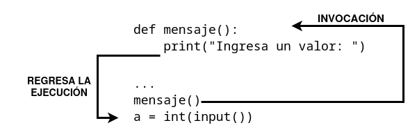

# Tu primera función

## Tu primera función

Tenemos el siguiente código de un programa:

```
print("Ingresa un valor: ")
a = int(input())

print("Ingresa un valor: ")
b = int(input())

print("Ingresa un valor: ")
c = int(input())
```
Es un código muy sencillo, pero observamos que es muy repetitivo:

* El mensaje enviado a la consola por la función `print()` es siempre el mismo. 
* Además la lectura por teclado también se repite aunque se guarden en variables distintas.

¿Qué ocurriría si tuviéramos que cambiar el mensaje? Habría que cambiar el mensaje en tres sitios del código.
Y, ¿si en vez de leer 3 variables, tuviéramos que leer 50?

Parece evidente que necesitamos alguna forma de reutilizar el código que estamos repitiendo. De esta manera sólo escribiríamos el código una vez, y si tuviéramos que cambiarlo sería un sólo cambio. Posteiormente podríamoos utilizar dicho código las veces que hicieran falta.

La solución sería codificar el código repetido en una **función** que pudiéramos utilizar tantas veces como necesitáramos.

## Definición de funciones

Para crear una función es necesario **definirla** de la siguiente manera:

```
def nombre_function():
    instrucciones de la función
```

* Siempre comienza con la palabra reservada `def` (que significa definir).
* Después de `def` va el **nombre de la función** (las reglas para darle nombre a las funciones son las mismas que para las variables).
* Después del nombre de la función, se ponen **dos paréntesis** (que como veremos pueden contener los parámetros de la función).
* La línea debe de terminar con **dos puntos**.
* A continuación, se escribe el **cuerpo de la función**: un conjunto de instrucciones que se escriben usando una sangría. Estas instrucciones se ejecutarán cada vez que llamemos o invoquemos a la función.

Siguiendo el ejemplo anterior, vamos a crear una función que nos ayude a escribir el mensaje en pantalla:

```
def mensaje():
    print("Ingresa un valor: ")
```

La función es muy sencilla, pero completamente utilizable. Hagamos uso de ella:

```
def mensaje():
    print("Ingresa un valor: ")

mensaje()
a = int(input())

mensaje()
b = int(input())

mensaje()
c = int(input())
```

Cosas a tener en cuenta:

* Debemos definir la función antes de usarla.
* Una instrucción con el nombre de la función la invoca, ejecutando las instrucciones del cuerpo de la función.

## Funcionamiento de las funciones



* Cuando se invoca una función, la ejecución de las instrucciones salta al cuerpo de la función.
* El cuerpo de la función es entonces ejecutado.
* Al llegar al final de la función, Python regresa al lugar inmediato después de donde ocurrió la invocación.

Esto implica lo siguiente:

* No se debe invocar una función antes de que se haya definido. El siguiente código nos da un error:
    ```
    mensaje()
    a = int(input())

    def mensaje():
        print("Ingresa un valor: ")
    ```

    El error será de tipo: `NameError: name 'mensaje' is not defined`.

* Una función y una variable no pueden compartir el mismo nombre. El siguiente código nos da un error:

    ```
    def mensaje():
        print("Ingresa un valor: ")

    mensaje = 1
    mensaje()
    ```


El asignar un valor al nombre `mensaje` se convierte en un entero, ya no es una función. Este programa nos daría une error: `TypeError: 'int' object is not callable`.

