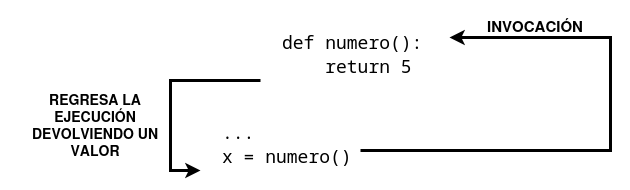

# Efectos y resultados de una función

Todas las funciones presentadas anteriormente tienen algún tipo de **efecto**: por ejemplo, escriben en pantalla.
Además de producir un efecto, las funciones puedes **devolver valores**.

Para lograr que las funciones devuelvan un valor (pero no solo para ese propósito) se utiliza la instrucción **return** (regresar o retornar).

### return sin una expresión

La primera consiste en la palabra reservada en sí, sin nada que la siga. Cuando se emplea dentro de una función, provoca la terminación inmediata de la ejecución de la función, y un retorno instantáneo (de ahí el nombre) al punto de invocación.

hay que indicar que si una función no está destinada a producir un resultado, emplear la instrucción `return` no es obligatorio, se ejecutará implícitamente al final de la función.

De cualquier manera, se puede emplear para terminar las actividades de una función, antes de que el control llegue a la última línea de la función.

Veamos un ejemplo:
```
def happy_new_year(wishes = True):
    print("Tres...")
    print("Dos...")
    print("Uno...")
    if not wishes:
        return
   
    print("¡Feliz año nuevo!")
```

Cuando se invoca sin ningún argumento: `happy_new_year()`. La función mostrará:
```
Tres...
Dos...
Uno...
¡Feliz año nuevo!
```

Sin embrago si mandamos el argumento de esta manera: `happy_new_year(False)`, se modificará el comportamiento de la función; la instrucción `return` provocará su terminación justo antes de ejecutar el ultimo `print()` y la salida será:

```
Tres...
Dos...
Uno...
```

### return con una expresión

La segunda variante de `return` nos permite devolver una valor que estará expresado en una expresión (recuerda que una expresión puede ser simplemente un literal o una variable):

Veamos un ejemplo sencillo:

```
def numero():
    return 15
```

Al usar el `return` ocurren dos cosas:

* Provoca la **terminación inmediata de la ejecución** de la función (nada nuevo en comparación con la primer variante).
* Además, la función evaluará el valor de la expresión y lo devolverá como el resultado de la función.

Ahora podemos llamar a la función de la siguiente manera:

```
x = numero()
print("La función numero ha devuelto su resultado. Es:", x)
```

El fragmento de código escribe el siguiente texto en la consola: `La función numero ha devuelto su resultado. Es: 123`.



El valor devuelto por la función se guarda en la variable `x`. Con el valor devuelto podemos hacer varias cosas:

1. Se puede asignar a una variable, como hemos visto.
2. Podemos usarlo en una expresión más compleja, donde la invocación de la función representa el valor devuelto, y el tipo de la función es el mismo que el tipo de datos del valor devuelto.
3. También puede ignorarse por completo y perderse sin dejar rastro.

Veamos un ejemplo de esto último:

```
def numero():
    print("'Modo aburrimiento' ON.")
    return 123

print("¡Esta lección es interesante!")
numero()
print("Esta lección es aburrida...")
```

El programa produce el siguiente resultado:

```
¡Esta lección es interesante!
'Modo aburrimiento' ON.
Esta lección es aburrida...
```
