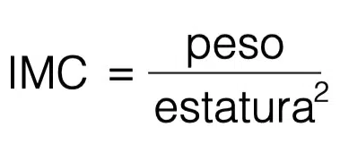

# Ejemplo 1: Cálculo del IMC

Definamos una función que calcula el **Índice de Masa Corporal (IMC)**.
El IMC es igual al peso en kilogramos dividido por la altura en metros al cuadrado:



Como puedes observar, la formula necesita dos valores:

* peso (originalmente en kilogramos).
* altura (originalmente en metros).

La nueva función tendrá dos parámetros. Su nombre será `imc`:

```
def imc(weight, height):
    return weight / height ** 2


print(imc(52.5, 1.65))
```

El resultado del ejemplo anterior es el siguiente: `19.283746556473833`.

La función hace lo que deseamos, pero es un poco sencilla - asume que los valores de ambos parámetros son significativos. Se debe comprobar que son confiables.

Vamos a comprobar ambos y regresar None si cualquiera de los dos es incorrecto.

