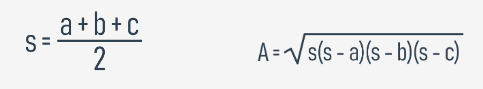

# Ejemplo 2: Triángulos

## Versión 1

Ahora trabajaremos con triángulos. Comenzaremos con una función que verifique si tres lados de ciertas longitudes pueden formar un triángulo.

Debemos comprobar que la suma arbitraria de dos lados tiene que ser mayor que la longitud del tercer lado. La función tendrá tres parámetros: uno para cada lado y devolverá `True` si los lados pueden formar un triángulo, y `False` de lo contrario.

```
def es_un_triangulo(a, b, c):
    if a + b <= c:
        return False
    if b + c <= a:
        return False
    if c + a <= b:
        return False
    return True


print(es_un_triangulo(1, 1, 1))
print(es_un_triangulo(1, 1, 3))
```

El resultado es:
```
True
False
```

Podríamos hacer una versión más compacta:

```
def es_un_triangulo(a, b, c):
    if a + b <= c or b + c <= a or c + a <= b:
        return False
    return True


print(es_un_triangulo(1, 1, 1))
print(es_un_triangulo(1, 1, 3))
```

¿Se puede compactar aun más?. Por supuesto, observa:

```
def es_un_triangulo(a, b, c):
    return a + b > c and b + c > a and c + a > b


print(es_un_triangulo(1, 1, 1))
print(es_un_triangulo(1, 1, 3))
```

Se ha negado la condición (se invirtieron los operadores relacionales y se reemplazaron los *ors* con *ands**, obteniendo una expresión simple para probar triángulos).

## Versión completa

Coloquemos la función en un programa más grande. Se le pedirá al usuario los tres valores y se hará uso de la función.

```
def es_un_triangulo(a, b, c):
    return a + b > c and b + c > a and c + a > b


a = float(input('Ingresa la longitud del primer lado: '))
b = float(input('Ingresa la longitud del segundo lado: '))
c = float(input('Ingresa la longitud del tercer lado: '))

if es_un_triangulo(a, b, c):
    print('Si, si puede ser un triángulo.')
else:
    print('No, no puede ser un triángulo.')
```

## Versión 2

En la segunda versión, intentaremos verificar si un triángulo es un triángulo rectángulo.

Para ello haremos uso del Teorema de Pitágoras:

c<sup>2</sup> = a<sup>2</sup> + b<sup>2</sup>

¿Cómo saber cual de los tres lados es la hipotenusa?: La hipotenusa es el lado más largo.

Aquí esta el código:

```
def es_un_triangulo(a, b, c):
    return a + b > c and b + c > a and c + a > b


def es_un_triangulo_rectangulo(a, b, c):
    if not es_un_triangulo(a, b, c):
        return False
    if c > a and c > b:
        return c ** 2 == a ** 2 + b ** 2
    if a > b and a > c:
        return a ** 2 == b ** 2 + c ** 2
    if b > a and b > c:
        return b ** 2 == c ** 2 + a ** 2


print(es_un_triangulo_rectangulo(5, 3, 4))
print(es_un_triangulo_rectangulo(1, 3, 4))
```

Observa como se establece la relación entre la hipotenusa y los dos catetos. Se eligió el lado más largo y se aplica el Teorema de Pitágoras para verificar que todo estuviese en orden.

## Versión 3

También es posible calcular el área de un triángulo. La Formula de Heron será útil aquí:



Este es el código resultante:

```
def es_un_triangulo(a, b, c):
    return a + b > c and b + c > a and c + a > b


def heron(a, b, c):
    p = (a + b + c) / 2
    return (p * (p - a) * (p - b) * (p - c)) ** 0.5


def area_triangulo(a, b, c):
    if not es_un_triangulo(a, b, c):
        return None
    return heron(a, b, c)


print(area_triangulo(1., 1., 2. ** .5))
```

Lo probaremos con un triángulo rectángulo la mitad de un cuadrado y con un lado igual a 1. Esto significa que su área debe ser igual a 0.5.

Es extraño pero el código produce la siguiente salida: `0.49999999999999983`.

Esto es debido a cálculo de valores de punto flotantes, que en ocasiones no nos permite reprentar todos los números y nos da un número muy cercano a la respuesta correcta.

