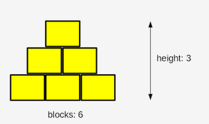

# LABORATORIO - Fundamentos del bucle while

## Tiempo Estimado

20 - 30 minutos

## Nivel de Dificultad

Medio

## Objetivos

Familiarizar al estudiante con:

* Utilizar el bucle `while`.
* Encontrar la implementación adecuada de reglas definidas verbalmente.
* Reflejar situaciones de la vida real en código de computadora.

## Escenario

Escucha esta historia: Un niño y su padre, un programador de ordenadores, juegan con bloques de madera. Están construyendo una pirámide.

Su pirámide es un poco rara, ya que en realidad es una pared en forma de pirámide, es plana. La pirámide se apila de acuerdo con un principio simple: cada capa inferior contiene un bloque más que la capa superior.

La figura ilustra la regla utilizada por los constructores:



Tu tarea es escribir un programa que lea la cantidad de bloques que tienen los constructores, y generar la altura de la pirámide que se puede construir utilizando estos bloques. Puedes usar esta plantilla:

```
altura = 0
bloques = int(input("Ingresa el número de bloques: "))

#
# Escribe tu código aquí.
#	

print("La altura de la pirámide:", altura)
```

Nota: La altura se mide por el número de capas completas: si los constructores no tienen la cantidad suficiente de bloques y no pueden completar la siguiente capa, terminan su trabajo inmediatamente.

Prueba tu código con los datos que hemos proporcionado.

## Datos de Prueba

* Entrada de muestra: 6
    * Salida esperada: La altura de la pirámide es: 3

* Entrada de muestra: 20
    * Salida esperada: La altura de la pirámide es: 5

* Entrada de muestra: 1000
    * Salida esperada: La altura de la pirámide es: 44

* Entrada de muestra: 2
    * Salida esperada: La altura de la pirámide es: 1

