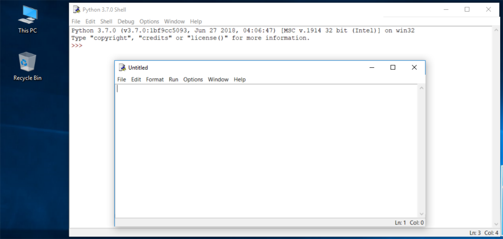
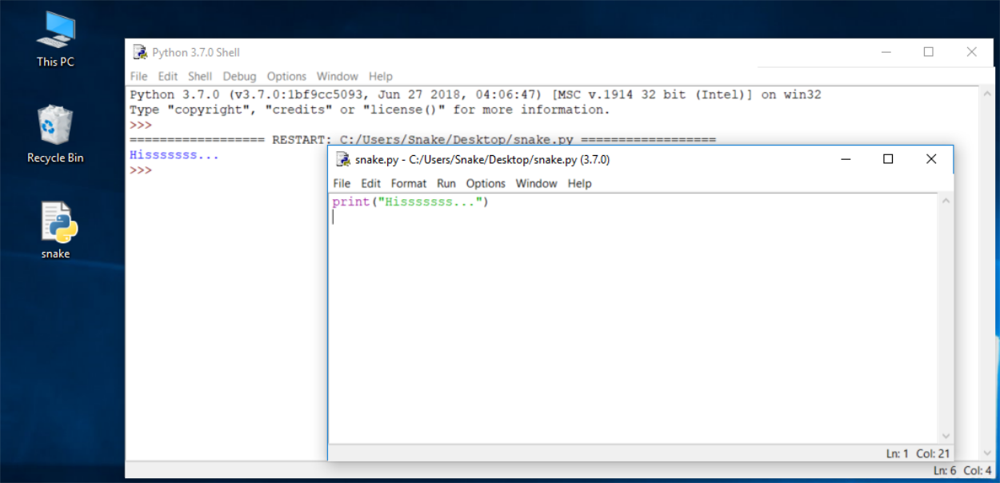

# Módulo 1: Introducción a Python y a la programación de ordenadores
## Sección 3: Descarga e instalación de Python
## Clase: Nuestro primer programa en Python

### Cómo escribir y ejecutar tu primer programa

Ahora es el momento de escribir y ejecutar tu primer programa en Python 3. Por ahora, será muy simple.

1. El primer paso es crear un nuevo archivo fuente y llenarlo con el código. Haz clic en *File* en el menú del IDLE y selecciona *New File*.

    

    Como puedes ver, IDLE abre una nueva ventana para ti. Puedes usarla para escribir y modificar tu código.

    Esta es la **ventana del editor**. Su único propósito es ser un lugar de trabajo en el que se trate tu código fuente. No confundas la ventana del editor con la ventana del shell. Realizan diferentes funciones.

2. La ventana del editor actualmente no tiene título, pero es una buena práctica comenzar a trabajar nombrando el archivo fuente.

    Haz clic en *File* (en la nueva ventana), luego haz clic sobre *Save as ...* , selecciona una carpeta para el nuevo archivo (el escritorio es un buen lugar para tus primeros intentos de programación) y elige un nombre para el nuevo archivo.

    

    Nota: no establezcas ninguna extensión para el nombre de archivo que vas a utilizar. Python necesita que sus archivos tengan la extensión .py, por lo que debes confiar en los valores predeterminados de la ventana de diálogo. El uso de la extensión .py permite que el sistema operativo abra estos archivos correctamente.

3. Ahora vamos a escribir nuestro primer programa, que sólo va a tener una línea.

    Ahora solo coloca una línea en tu ventana de editor recién abierta y con nombre.

    ```
    print("Hisssssss...")
    ```

    Puedes utilizar el portapapeles para copiar el texto en el archivo. Si escribes las comillas utiliza la combinación de teclas *Shift + 2*.

    

    Guarda el archivo (*File -> Save*) y ejecuta el programa (*Run -> Run Module*).

4. Si todo sale bien y no hay errores en el código, la ventana de la consola mostrará los efectos causados por la ejecución del programa.

    En este caso, el programa se ejecutará de manera correcta y mostrará Hisssssss... en la consola Intenta ejecutarlo una vez más. Y una vez más. Ahora cierra ambas ventanas y vuelve al escritorio.

    